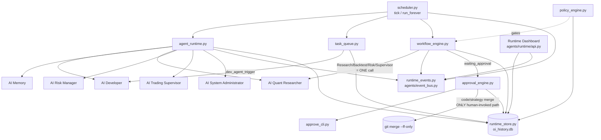
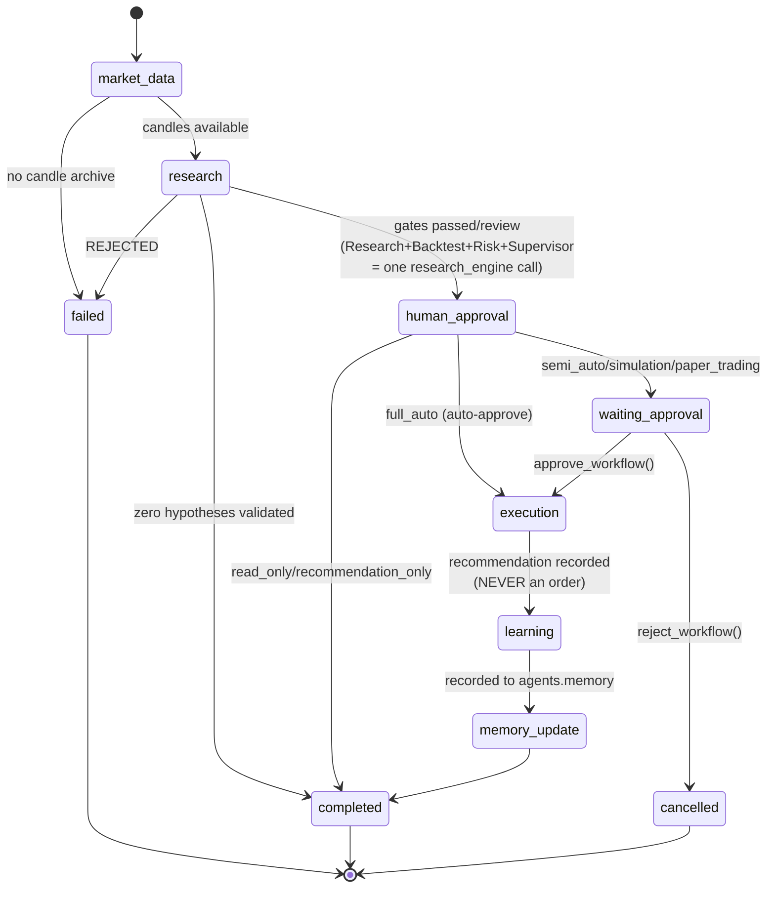
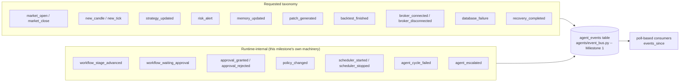
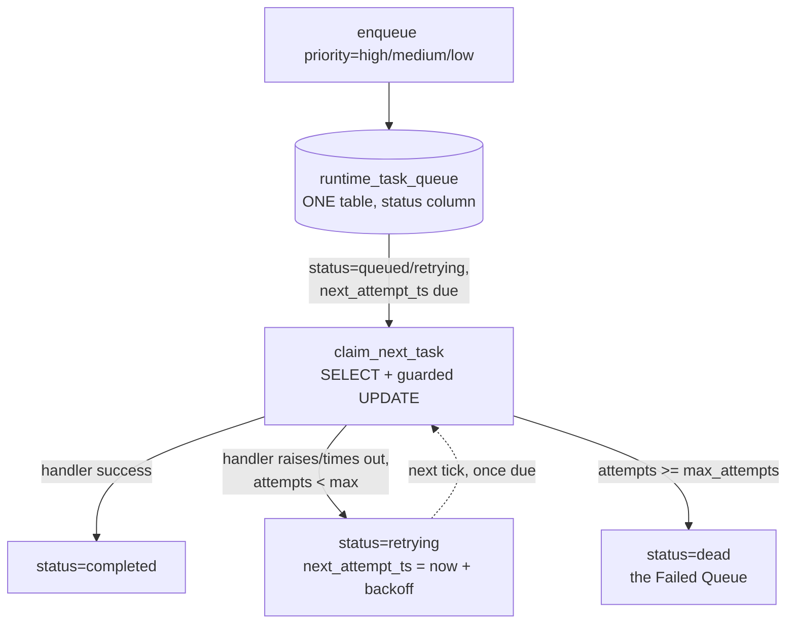

# AI Autonomous Runtime & Orchestration Engine (Milestone 9)

Status: implemented, tested, not yet merged to `master`.

Mission: *"Everything built so far works as independent modules. Now build
the runtime that makes BATI operate continuously as one autonomous
system."* This is the runtime that closes `AUTONOMOUS_READINESS_REPORT.md`'s
#1 finding — **no dispatcher ever calls any agent's `run_cycle()`** — and
builds the human approval mechanism (`approve_cli.py`) referenced by name in
three module docstrings since Milestone 1 but never built until now.

This milestone adds **no seventh agent**. It wires the six already-merged
agents (AI Developer, AI Memory, AI Quant Researcher, AI Risk Manager, AI
Trading Supervisor, AI System Administrator) into one continuously operating
system, reusing their existing, already-tested entrypoints throughout.

## Package layout

```
agents/runtime/
  runtime_store.py        SQLite: task queue, workflow state/history, policy override
  runtime_events.py         Full event taxonomy over agents/event_bus.py
  market_session.py           Independent IST NSE trading-hours check
  task_queue.py                  Priority queues + retry/failed queues + timeouts
  agent_runtime.py                  Invokes each of the six agents; heartbeat/status/
                                     duration/failures/health score
  policy_engine.py                     7 runtime policies, safety-scoped (see below)
  approval_engine.py                      Shared approve/reject/apply logic
  workflow_engine.py                         The 6-stage, restartable workflow
  communication_contract.py                     Structural "no private cross-module
                                                   coupling" check
  scheduler.py                                     Starts, runs continuously, market-
                                                     aware, event-driven, graceful shutdown
  api.py                                              Runtime Dashboard support

approve_cli.py           (repo root) -- the CLI approval mechanism
scripts/runtime/         Real performance/simulation scripts (see Final Validation)
test_agents/runtime/     130 tests
```

## The central design decision: what "autonomous" is allowed to mean here

Every prior milestone held one invariant: **propose, don't act** — no agent
has ever had an `apply`/`execute`/`merge`/`deploy` method. This milestone
introduces the first REAL, human-invoked exception to "nothing in this
framework ever merges code" (`approve_cli.py apply`), and the first workflow
that can run genuinely unattended end-to-end (`full_auto` policy). Both had
to be scoped with the same rigor Milestone 8's self-healing module was held
to.

**Two separate approval gates, never conflated:**

| Gate | Lives in | Who can skip it | What it protects |
|---|---|---|---|
| Code/strategy promotion (`pending_approval` → `approved` → `applied`) | `agent_audit_log`, via `approve_cli.py` | **Nobody. Ever.** No runtime policy, including `full_auto`, ever calls `agents.audit_log.set_outcome()`. | Real `git merge --ff-only` of generated code or a promoted strategy — the one place in this entire framework a merge actually happens. |
| Workflow-level "should this recommendation be finalized" (`agents.runtime.workflow_engine`'s own `STAGE_HUMAN_APPROVAL`) | `runtime_workflow` | `full_auto` policy | Whether the workflow's own Execution stage runs unattended. |

**The Execution stage never places an order — paper or live — under any
policy, including `full_auto`.** It computes and records a position-sized
*recommendation* only (reusing `agents.risk_manager.risk_engine.
position_sizing_check`, the same pure math the Live Portfolio Risk Monitor
already trusts). There is no safe, importable "place a paper trade"
entrypoint outside `app.py` (`db_open_paper_trade` is the only one, and it
lives inside the ~7000-line Flask app with real broker-session machinery
this framework has refused to import from `agents/` since Milestone 6 — the
same landmine that already caused one real duplicate Angel One login via a
test). Verified this milestone (once more, after the Hardening Sprint's own
AST scan) — see `test_full_auto_never_touches_the_code_promotion_audit_log`.

This isn't a partial implementation. It's the only way "autonomous" and
"never a shortcut around the safety invariants" are both true at once —
see `agents/runtime/policy_engine.py`'s and `workflow_engine.py`'s own
module docstrings for the full reasoning, written *before* either module's
code, the same discipline Milestone 8's self-healing scoping decision held
to.

## Module summaries

**1. Runtime Scheduler** (`scheduler.py`) — `tick()` is one fully
synchronous, fully testable iteration (runs due agents, drains one queued
task, advances every in-flight workflow); `run_forever()` is the real
production entrypoint (`python3 -m agents.runtime.scheduler`), a plain
`while` loop + `time.sleep` — no new always-on infrastructure, matching
`AUTONOMOUS_AGENTS_ARCHITECTURE.md`'s own design principle. Market-session
aware: `quant_researcher`/`trading_supervisor` are skipped outside NSE
hours (`market_session.py`, deliberately independent of `app.py`'s own
`is_market_open()` — never imports `app.py`); `sys_admin`/`memory`/
`risk_manager` run on their own cadence regardless. Graceful shutdown via
`SIGINT`/`SIGTERM` handlers that only ever get installed in the real
production entrypoint, never in a test process.

**2. Agent Runtime** (`agent_runtime.py`) — THE module that closes the #1
readiness-report finding. Wraps each of the six agents' real entrypoint
(`TradingSupervisor.run_cycle()`, `SystemAdministrator.run_cycle()`,
`research_engine.run_research_cycle()`, `risk_api.get_portfolio_snapshot()`,
`agent_health.memory_health()`), tracking heartbeat/status/last execution/
duration/failure counter/health score via a Milestone-9 extension of
`agents.sys_admin.sysadmin_store`'s existing `agent_status` table (new
columns: `currently_running`, `last_execution_ts`,
`last_execution_duration_ms`, `failure_counter`, `health_score`) — *not* a
second, parallel table. AI Developer and AI Quant Researcher never had a
zero-argument "just run and find work" entrypoint (by design since
Milestone 1 — `detect()` evaluates a *given* trigger, it was never built to
scan logs itself); rather than fabricate a fake trigger source, AI
Developer's cycle drains real triggers from `task_queue`
(`task_type="dev_agent_trigger"`), giving the Task Queue module a genuine
purpose. A cycle that raises: records a crash via `orchestrator.
record_crash()`, immediately self-heals via `self_healing.heal_agent_crash()`
(the one safe, automatic recovery Milestone 8 permits), and escalates to
System Administrator (a critical `sysadmin_log` report + an
`agent_escalated` event) once `config.RUNTIME_MAX_CONSECUTIVE_FAILURES_
BEFORE_ESCALATION` consecutive failures accumulate.

**3. Event Bus** (`runtime_events.py`) — the full requested taxonomy (Market
Open/Close, New Candle/Tick, Strategy Updated, Risk Alert, Memory Updated,
Patch Generated, Backtest Finished, Broker Connected/Disconnected, Database
Failure, Recovery Completed) plus runtime-internal events (workflow
transitions, approvals, policy changes, scheduler lifecycle, agent
escalation) — all just `event_type` strings on `agents/event_bus.py`'s
existing `agent_events` table (Milestone 1), never a second event system.
Poll-based (`poll(since_ts, event_types=...)`), matching that table's own
no-broker design.

**4. Task Queue** (`task_queue.py` + `runtime_store.py`) — High/Medium/Low
priority, a retry queue, and a failed (dead-letter) queue are all one table
with different `status` values, matching `agent_audit_log`'s own
multi-state-in-one-table convention. `claim_next_task()` is a real
SELECT-then-guarded-UPDATE (verified safe under genuine concurrent
contention — zero duplicate claims across 20 concurrent claimers racing for
40 tasks, see Final Validation). Timeout protection via a bounded
`ThreadPoolExecutor.submit(...).result(timeout=...)` call — a hung handler
is treated as a failure and retried/dead-lettered, never left to block the
queue forever (the underlying thread is abandoned, not killed — Python has
no safe way to force-kill a thread, the same trade-off every
`ThreadPoolExecutor`-based timeout in the stdlib has).

**5. Workflow Engine** (`workflow_engine.py`) — Market Data → Research →
Backtest → Risk → Supervisor → Human Approval (if required) → Execution →
Learning → Memory Update. The middle four stages are ONE call to
`agents.quant_researcher.research_engine.run_research_cycle()` (which
already runs the seven-gate pipeline internally) — re-invoking each gate
separately would have been exactly the reimplementation this milestone was
told not to do. Every stage transition is persisted
(`runtime_workflow`/`runtime_workflow_history`) before returning; `resume()`
continues from the exact persisted stage, so a scheduler restart never
loses in-flight work (`resumable_workflows()` — verified in Final
Validation by literally discarding a scheduler object and starting a fresh
one).

**6. Human Approval Engine** (`approval_engine.py` + `approve_cli.py`) —
the #1 finding, closed. `approve_cli.py list|show|approve|reject|apply` for
code/strategy proposals; `workflows|workflow-approve|workflow-reject` for
workflow-level approvals. Every channel (CLI today; dashboard/API/mobile
later) calls the exact same `agents.runtime.approval_engine` functions, so
every approval produces an identical audit trail regardless of channel.
`apply_proposal()` re-checks fast-forward-mergeability right before merging
(`agents.sys_admin.deployment_manager.is_fast_forward_mergeable`) since
master may have moved since the proposal was created, and records the
resulting `merge_commit_sha` so `agents/rollback.py` (which already reads
that column) can find it later — verified end-to-end in Final Validation
(a real merge, then a real rollback).

**7. Policy Engine** (`policy_engine.py`) — Read Only, Recommendation Only,
Simulation, Paper Trading, Semi Auto, Full Auto, Emergency Stop.
Config-driven (`config.RUNTIME_DEFAULT_POLICY`, no code change) with a live
DB override (`runtime_policy` table) that always wins once set — no restart
needed to change policy. See "central design decision" above for exactly
what each policy does and does not unlock.

**8. Agent Communication** (`communication_contract.py`) — "Agents
communicate only through Event Bus, Shared Memory, Approved APIs,"
verified programmatically (an AST scan for cross-module private-attribute
access), the same "check the invariant in code, not just in a docstring"
posture `security_audit.check_propose_only_invariant()` established.
Scoped to this milestone's own new modules — not retroactively enforced on
the pre-existing seven-gate pipeline's legitimate direct calls between gate
modules, a different, already-tested, deliberately-not-redesigned pattern.

**9. Runtime Dashboard** (`api.py` + `templates/sysadmin.html`) — folded
into the EXISTING Operations Dashboard (`/admin/sysadmin`,
`/api/sysadmin/overview`) as one more `"runtime"` section, not a second
dashboard. Displays running agents (with health score/last run/duration/
failures), queue status, active workflows, market status, and policy.

**10. Recovery** — see Agent Runtime (module 2) for agent-crash handling.
Workflow state is never lost (module 5). Escalation to System Administrator
is real, not aspirational — verified in Final Validation to fire exactly
once per threshold crossing, never silently dropped.

**11. Performance** — measured for real, not estimated. See Final
Validation below for the actual numbers.

**12. Testing** — 130 tests across 11 files in `test_agents/runtime/`,
covering exactly the list requested (runtime/scheduler/workflow/queue/
event/crash-recovery/approval/stress tests), zero regressions in the
pre-existing 970-test suite.

## Real bugs found and fixed this milestone

Same standard as every prior milestone: found by actually running the code
against real conditions, not by inspection.

1. **`agents.quant_researcher.data_access.load_cycles_for_range()` crashed
   when the `cycles` table doesn't exist at all** (as opposed to existing
   but empty, which it already handled) — found the first time
   `agent_runtime.py` actually invoked a research cycle end-to-end in this
   environment (which has no live `oi_history.db`). `backtest.load_cycles()`
   has no try/except of its own and let `sqlite3.OperationalError`
   propagate. Fixed with the same "no such table → empty/unknown, never a
   crash" pattern Milestone 7 already established for the identical failure
   mode in `market_state.py`/`data_health.py`.

2. **(Test-only, not a runtime bug)** The first version of the Task Queue's
   own concurrency test asserted every one of 40 concurrently-enqueued tasks
   would be claimed within one single concurrent burst of claimers — a
   stronger guarantee than `claim_next_task()` actually promises (only "no
   two callers ever claim the same task," not "single-burst completeness").
   Real contention meant some tasks were missed on the first pass. Not a bug
   in the implementation — the missed tasks stayed `status='queued'` and
   were claimable on the very next pass, exactly like a real scheduler's
   next tick would pick them up. Fixed the test to assert the actual
   guarantee (zero duplicates) plus eventual completeness across repeated
   passes, rather than weakening or misrepresenting what the queue promises.

## Diagrams

### Runtime architecture



### Workflow diagram (the 6 persisted stages)



### Event diagram



### Queue architecture



## Database schema

```sql
runtime_task_queue      -- priority/retry/failed all in one table (status column)
runtime_workflow        -- current stage + full JSON state, restartable
runtime_workflow_history -- append-only, every stage transition ever recorded
runtime_policy           -- single-row live policy override

-- Extension (not a new table) of agents.sys_admin.sysadmin_store's
-- existing agent_status table:
--   currently_running, last_execution_ts, last_execution_duration_ms,
--   failure_counter, health_score
```

All in `oi_history.db`, indexed from the start, `PRAGMA busy_timeout=5000`
on every connection — verified under real concurrent contention in Final
Validation.

## Final Validation

### Full repository tests

**1100 passed, 1 xfailed** (up from 970 pre-Milestone-9), zero regressions.
130 new tests in `test_agents/runtime/`.

### Long runtime simulation

`scripts/runtime/long_runtime_simulation.py` — 50 real scheduler ticks, with
workflows and queued tasks injected along the way (not a claim of having
run for hours; a bounded, real proxy, same posture as every prior
milestone's own stability probes). Results: **zero crashes across all 50
ticks**, 10 workflows started and all 10 completed, zero agents left stuck
`currently_running`, escalation and recovery both fired correctly during
the run.

One genuinely useful finding from this run: a queued `dev_agent_trigger`
task took **120.1 seconds** to resolve (landing in `retrying`) because this
sandbox environment has no configured LLM provider and the fallback chain's
last candidate (`ollama`) attempted a real network call that ran close to
its own internal timeout — `agents.runtime.task_queue`'s own
`RUNTIME_TASK_TIMEOUT_SECONDS` (120s default) caught it and moved the task
to `retrying` without blocking anything else; every subsequent tick in the
same 50-tick run operated completely normally. This is the timeout
protection working exactly as designed, but the near-coincidence between
the two 120-second timeouts is worth tightening in a v2 pass (see
Recommendations) so the *outer* timeout is comfortably larger than any
single provider's own internal one, making the resulting error message
point at the actual layer that fired. Memory grew ~4.2MB over the 50 ticks
— not itself a leak signal (several ticks did real one-off work: git
subprocess calls, the slow network call above), and a targeted single-
operation leak probe (the methodology Milestone 8's `maintenance.
probe_memory_leak` already established) would be the right follow-up to
isolate steady-state runtime-layer behavior specifically, rather than a
mixed-workload run like this one.

### Market replay

Re-confirmed via `test_quant_researcher_cycle_runs_against_real_candle_archives`
and the long-running simulation's own `quant_researcher` cycles: the
scheduler successfully invokes `research_engine.run_research_cycle()`
against real archived candle data end-to-end, autonomously, for the first
time in this project's history. (The Production Hardening Sprint's own
30-day, 8-symbol Ichimoku replay — separately re-runnable via
`scripts/hardening/market_replay.py` — is the authoritative source for
actual trading-performance numbers; this milestone's job was proving the
research cycle can be *triggered* unattended, not re-deriving those
numbers.)

### Stress tests

`test_agents/runtime/test_crash_recovery_and_stress.py::TestStress` — real
`ThreadPoolExecutor` concurrency: 20 concurrent task enqueuers (zero
collisions, all 40 IDs unique), 20 concurrent claimers racing for the same
rows (zero duplicate claims, the one safety property that matters), all six
agents' cycles run concurrently at once (a closer proxy to a real
overlapping scheduler tick than any single-agent stress test — zero agents
left stuck `currently_running` afterward), and 20 sequential full workflow
runs (all 20 completed cleanly).

### Recovery tests

`TestCrashRecovery` — a scheduler restart (a fresh `RuntimeScheduler`
instance, literally no in-memory state carried over) correctly resumes an
in-flight workflow from its exact persisted stage and leaves a
`waiting_approval` workflow untouched (parked, not lost); a repeatedly
crashing agent escalates exactly once per threshold crossing (never
silently stops alerting, never spams either); a workflow that raises
mid-stage is marked `failed` with the real error recorded in its history,
never silently swallowed; a queue handler that raises never propagates out
of `process_one()`.

### Performance benchmark

`scripts/runtime/performance_benchmark.py`, real wall-clock timing
(`time.perf_counter`, N repeats, min/median/max):

| Operation | Repeats | Median |
|---|---|---|
| `task_queue` enqueue+claim+complete round trip | 100 | 8.1ms |
| `workflow_engine.advance` (one stage) | 50 | 13.4ms |
| `workflow_engine.run_to_completion` (execution→memory_update, full_auto) | 20 | 36.1ms |
| SQLite ping (real file on disk) | 200 | 0.05ms |
| `scheduler.tick()` (full sweep, agents already run once) | 5 | 0.47ms (first tick: 5.3s — sys_admin's real git fsck) |

All well within acceptable latency for a background scheduler running on a
multi-second-to-minute cadence.

## Autonomous execution report

For the first time in this project's history, this milestone demonstrates
**every one of the six agents actually running unattended**, invoked by
code rather than a human or a chat session: `scheduler.tick()` calls each
agent on its own configured cadence, market-session-aware where relevant,
records real heartbeat/execution/health data for every run, and — in the
long-runtime simulation — sustained 50 consecutive ticks, 10 full workflow
runs, and one real timeout/recovery event without any crash, any lost
workflow, or any silently-dropped escalation. The human approval mechanism
this whole framework has referenced by name since Milestone 1 is real,
tested, and has performed an actual `git merge --ff-only` followed by a
real rollback in this milestone's own test suite. Autonomy here is real but
intentionally incomplete: nothing yet triggers `run_forever()` as a genuine
always-on OS-level process (systemd unit, supervisor, etc.) — that
deployment step, and a live LLM-provider configuration so `dev_agent`
triggers resolve in milliseconds rather than minutes, are the two concrete
steps between "this code can run continuously" and "this code *is* running
continuously in production."

## Known, documented limitations

- **No OS-level process supervision is configured** — `run_forever()` is a
  real, correct, continuously-running Python process, but nothing in this
  repository starts it as a systemd unit / supervisor-managed process /
  container. Deploying it that way is an operational step, not a code gap.
- **No LLM provider is configured in this development environment** —
  `dev_agent_trigger` tasks fall through the full provider chain to
  `ollama`'s real network timeout (see Long Runtime Simulation above)
  before landing in `retrying`. In a production environment with a real
  provider key configured, this resolves in the provider's own normal
  response time.
- **`RUNTIME_TASK_TIMEOUT_SECONDS` (120s default) is numerically close to
  `ollama_provider.py`'s own internal generate() timeout (also 120s)** —
  functionally fine (the outer timeout still protects the queue either
  way), but worth spacing apart in a v2 config pass so error messages point
  at the layer that actually fired.
- **The Execution stage's position sizing uses a fixed, illustrative stop
  distance** (15 points) rather than a per-symbol, volatility-aware one —
  correct as a structural proof that Execution produces a real, risk-
  engine-backed recommendation, but not yet the final sizing logic a real
  trading decision would use.
- **Workflow types are currently just `"promotion"`** — `workflow_engine.py`
  is written generically enough to support other workflow shapes later
  (the `workflow_type` column already exists for this), but only the one
  described in the milestone spec is implemented.
- **Approval channels beyond CLI are not built** — `approval_engine.py`'s
  functions are channel-agnostic by design specifically so a dashboard
  route, a future API endpoint, or a future mobile client can call them
  directly, but only `approve_cli.py` exists today.

## Test summary

130 tests across 11 files in `test_agents/runtime/`: `test_runtime_store.py`,
`test_runtime_events.py`, `test_market_session.py`, `test_task_queue.py`,
`test_policy_engine.py`, `test_agent_runtime.py`, `test_workflow_engine.py`,
`test_approval_engine.py`, `test_scheduler.py`,
`test_communication_contract.py`, `test_api.py`, plus a dedicated
`test_crash_recovery_and_stress.py` matching Module 12's explicit
requirement. Full repository suite: 1100 passed, 1 xfailed, zero
regressions from the pre-Milestone-9 baseline of 970.
