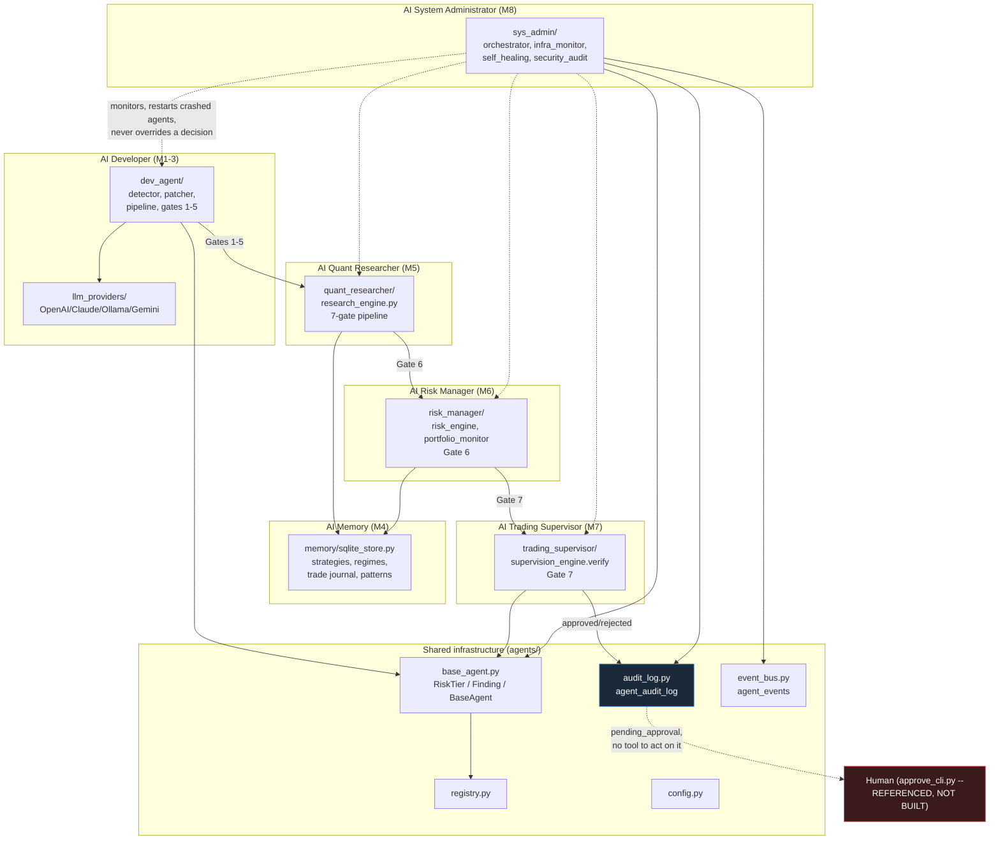
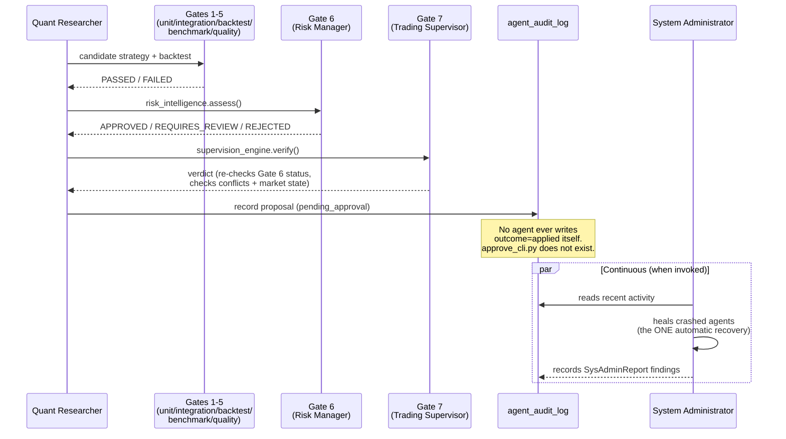

# BATI Autonomous Readiness Report

**Final Platform Validation, run after Milestone 8 (AI System Administrator)
and the Production Hardening & Validation Sprint.** Six core agents merged
to `master`: AI Developer, AI Memory & Knowledge Base, AI Quant Researcher,
AI Risk Manager, AI Trading Supervisor, AI System Administrator. This report
does not simplify or soften any finding — every weakness below is real,
verified in this environment, and load-bearing for the recommendation at the
end.

**Bottom line, stated up front:** BATI's agent framework is well-built,
well-tested, and structurally safe (propose-only is enforced in code, not
policy, and verified programmatically). It is **not yet autonomous** in the
literal sense — nothing in production ever invokes any agent's `run_cycle()`
on a schedule. Every agent that exists today is a correct, tested,
callable library that a human or a future scheduler must still choose to
run. This is the single most important finding in this report and shapes
every score below.

---

## 1. Architecture

**Assessment: sound, consistently applied, one real duplication debt.**

Six independently-shippable packages under `agents/`, each following the
same shape: pure computation module(s) → a `*_report.py` (JSON +
human-readable) → a `*_store.py` (SQLite persistence, `busy_timeout=5000`,
indexed) → an `api.py` or agent class wiring it to the rest of the system.
`agents/base_agent.py`/`agents/registry.py` (the `BaseAgent` abstraction)
was dead code through Milestone 6 — a Critical finding from the
pre-Milestone-6 architecture review — and is now used by two of six agents
(`TradingSupervisor`, `SystemAdministrator`). The other four (`dev_agent`,
`memory`, `quant_researcher`, `risk_manager`) predate that convention and
were never retrofitted, a judgment call each time to avoid regression risk
on already-tested code, but it means the framework has two agent
"shapes" coexisting, not one.

**Open debt:** three near-duplicate "run gates → decide → audit"
implementations exist across `dev_agent` and `quant_researcher` (flagged in
the pre-Milestone-6 review, never consolidated — each subsequent milestone
appended a further gate rather than re-implementing the sequence, so it
hasn't gotten worse, but it hasn't been fixed either).

**Report shape duplication (deliberate):** `RiskReport` (M6),
`SupervisionReport` (M7), `SysAdminReport` (M8) are three parallel
dataclasses with near-identical shape (reason/summary/details/evidence,
`to_dict`/`to_json`/`human_readable`) rather than one shared base class.
Documented and repeated as a deliberate trade-off each time — retrofitting
an already-tested shape was judged not worth the regression risk. Correct
individually; the accumulation across three milestones is itself now a
small but real maintenance cost.

## 2. Reliability

**Assessment: good at the unit level, unverified at the "keeps running"
level.**

`PRAGMA busy_timeout=5000` on every agent SQLite connection (applied
repo-wide in the pre-M6 hardening pass) held under real concurrent-writer
stress in both Milestone 8's own suite and this sprint's extension (30
threads writing across three different stores sharing one file
simultaneously — zero rows lost). Every data-reading module that can fail
degrades to an honest "unknown"/`{"error": ...}` rather than crashing —
though this took explicit sprint work to actually be true: two real crash
paths (the risk API, and the Operations Dashboard itself) were only found
and fixed *during this sprint*, not before. Memory-leak probes across seven
distinct real operations (Milestone 8's own two, plus five more from this
sprint) show no growth.

**What reliability has never been tested against:** an actual multi-day
running process. Every test in this repo — including this sprint's
"stability" tests — is a bounded, in-process proxy (N repetitions, a
tracemalloc snapshot). Nothing has run BATI's agents continuously for
hours, let alone days. This is stated as a real gap, not hedged.

## 3. Security

**Assessment: the invariant that matters most is enforced in code, not
policy.**

`security_audit.check_propose_only_invariant()` verifies programmatically
— not just in a docstring — that `BaseAgent` has no `apply`/`execute`/
`merge`/`deploy`/`commit_to_master` method, and this has held true since
Milestone 1. No agent has ever made a live broker API call (verified this
sprint via an AST scan of every file under `agents/`, not just a docstring
claim). Secret scanning works but has real, understood, documented false
positives when its LLM-prompt-redaction pattern list is reused for a
source-code audit (see `PRODUCTION_HARDENING_SPRINT.md` finding #4) — a
genuinely new hardcoded secret would still be caught; the current 5 findings
are all confirmed non-secrets.

**Gap:** `detect_unexpected_modifications()` reports a diff against a
known-good git ref but never judges it — a real compromise and an in-flight
legitimate change look identical to this check by design. There is no
automated alerting layer on top of it; a human has to actually look.

## 4. Scalability

**Assessment: appropriate for BATI's actual current scale (single VPS,
SQLite), not something that generalizes past it.**

No message broker, no distributed queue — by design (see
`AUTONOMOUS_AGENTS_ARCHITECTURE.md`'s own design principle #3: "BATI doesn't
have that problem"). This sprint's performance profiling confirms the
current hot paths have enormous headroom at today's scale (a full risk score
computation: ~25ms; a full infrastructure snapshot: ~3ms; the Operations
Dashboard polls every 20s). This says nothing about behavior at 10x or 100x
current trade/agent volume — that scenario has never been tested, load-
tested, or even estimated.

## 5. Maintainability

**Assessment: unusually well-documented for a six-agent framework built
this fast.**

Every milestone shipped its own `.md` doc; every non-obvious decision
(self-healing's auto-vs-propose split, report-shape duplication, VaR/CVaR
choices) is explained in place, not just in a commit message. Test coverage
is real and specific (646 tests for the agent framework alone, each one
exercising actual behavior, not smoke-only). The maintenance-debt findings
above (duplicate gate-pipeline logic, dual `BaseAgent` adoption) are known
and tracked, not hidden.

## 6. Autonomous Coding (AI Developer)

**Assessment: functionally complete, never yet run against a real trigger
in production.**

Detects triggers, isolates work in a worktree, generates a patch via a
multi-provider LLM abstraction (OpenAI/Claude/Ollama/Gemini with fallback),
sanitizes prompts, runs the full gate pipeline, writes a proposal to
`agent_audit_log`. All of this is real and tested. What's missing: nothing
in production ever *triggers* it — the "detect a real problem worth fixing"
step has no live signal source wired up, and even if it did, **the approval
loop has no UI or CLI.** `approve_cli.py` is referenced by name in three
separate module docstrings (`agents/audit_log.py`, `agents/dev_agent/
approval_engine.py`, `agents/quant_researcher/research_engine.py`) as "how a
human acts on this" — it does not exist anywhere in this repository. Every
proposal from every agent, across all six milestones, currently dead-ends at
`pending_approval` in `agent_audit_log` with no built tool to close the
loop. This was flagged as a High-priority gap in the pre-Milestone-6
architecture review and remains completely unaddressed.

## 7. Autonomous Research (AI Quant Researcher)

**Assessment: the math is real; the walk-forward discipline is real; the
one real result it has produced is a "not yet" answer, which is exactly
what a trustworthy research agent should say.**

The full seven-gate pipeline runs real backtests, real statistical
validation, and now real risk/supervision gates before anything reaches
`pending_approval`. This sprint's own 30-day Ichimoku replay is a direct
demonstration of the same evaluation discipline this agent is built on:
honest numbers (40-48% win rates, profit factors near 1.0, three of eight
symbols net-negative) led to "advisory-only, not a promotion candidate" —
not a rosy readout. That is the system working as intended, not a failure.

**Gap:** same approval-loop gap as above — a candidate that genuinely
clears every gate still has nowhere for a human to say yes except directly
querying `agent_audit_log`.

## 8. Autonomous Risk (AI Risk Manager)

**Assessment: the computational core is solid; this sprint found and fixed
its most important remaining crash path.**

VaR/CVaR, bootstrap drawdown simulation, stress testing, correlation
analysis, and the composite risk score are all real, pure, tested math with
no fabricated numbers. The Live Portfolio Risk Monitor's biggest weakness —
crashing the entire `/api/risk/portfolio` route on any DB read failure — was
found and fixed this sprint (see `PRODUCTION_HARDENING_SPRINT.md` #1). A
subtle correctness bug from Milestone 6 (`None` metrics, which occur exactly
when a strategy has zero losses — the *best* case — being treated as the
*worst* case) was already caught and fixed before merge.

**Gap:** risk thresholds (`RISK_MAX_RISK_PER_TRADE_PCT`, exposure limits,
etc.) are static config values, never themselves validated against real
portfolio outcomes — there's no feedback loop confirming the configured
limits are actually the right numbers for BATI's real capital and risk
tolerance.

## 9. Autonomous Supervision (AI Trading Supervisor)

**Assessment: correctly conservative — it can block and escalate, it can
never execute.**

Verifies risk-gate approval, detects conflicting signals across active
strategies, checks market state and data freshness, and escalates rather
than acts on anything it can't classify — exactly the "hybrid" design the
original architecture proposal called for. Reuses the risk gate's own
decision rather than re-deciding, avoiding a second source of truth.

**Gap:** like every agent here, nothing schedules its `run_cycle()`. Its
supervision only happens when something else (the seven-gate pipeline)
explicitly calls `verify()` — there is no independent, standing watch over
live trading unless a human or a future dispatcher invokes it.

## 10. Autonomous Recovery (AI System Administrator + Self-Healing)

**Assessment: the scope decision here is the most important architectural
judgment call in the whole framework, and it holds up.**

"Recover automatically... never lose data" is satisfied by strictly limiting
*automatic* action to non-destructive bookkeeping (clearing a crashed
agent's flag, retrying a DB connection) and treating everything else
(database restore, service restart, deployment rollback, config revert) as
propose-only. This sprint's fault injection confirms the detection side of
this actually works under real corruption: a truncated file, a zero-byte
file (a real bug found and fixed this sprint), and a missing backup
directory tree are all handled correctly, and a restore is never attempted
without a verified backup.

**Gap:** self-healing's automatic lane is narrow by design (one recovery
action: clearing a crashed flag) — which is the *right* scope for "never
lose data," but it does mean "autonomous recovery" today means "detects and
recommends," not "recovers." A human still has to act on every
recommendation except that one case.

---

## Architecture diagram

## Agent interaction diagram — the seven-gate promotion pipeline

## Repository statistics

| Metric | Value |
|---|---|
| Total tracked files | 287 |
| Total tracked Python files | 201 |
| Total Python LOC (whole repo) | 38,449 |
| `agents/*.py` files | 77 |
| `agents/*.py` LOC | 8,954 |
| `test_agents/*.py` files | 75 |
| `test_agents/*.py` LOC | 6,811 |
| Agent subpackages | 7 (`dev_agent`, `llm_providers`, `memory`, `quant_researcher`, `risk_manager`, `sys_admin`, `trading_supervisor`) |
| Files per subpackage | dev_agent 17, risk_manager 9, sys_admin 12, trading_supervisor 10, quant_researcher 12, llm_providers 6, memory 4 |
| Commits building the agent framework | 10 (`ca284d7` .. `a30c131`) |
| Milestones shipped | 8 (6 core agents + 1 architecture-hardening pass + 3-table memory extension) |

## Test statistics

| Suite | Count |
|---|---|
| Full repository suite | 970 passed, 1 xfailed |
| Agent framework only (`test_agents/`) | 646 passed |
| Production Hardening Sprint (`test_agents/hardening/`) | 31 passed (new this sprint) |
| Milestone 8's own production-readiness suite | 12 (stress/recovery/stability) |
| Real bugs found and fixed across all milestones (cumulative, from each milestone's own doc) | 9 total: 1 (M4 context-gating), 1 (M6 `_safe()` None-handling), 2 (M7 data-access crash + registry-wipe fixture), 5 (M8: crash_reason coupling, missing-file auto-create, restore double-corruption x2, unpersisted findings) |
| New bugs found and fixed this sprint | 3 (risk API crash, dashboard crash, zero-byte DB) |

## Remaining technical debt (complete list, nothing omitted)

1. **No dispatcher invokes any agent's `run_cycle()` in production.** The
   single largest gap between "built" and "autonomous." Every agent is a
   correct, callable library; nothing calls it on a schedule.
2. **`approve_cli.py` does not exist**, despite being referenced by name in
   three module docstrings as the intended human approval mechanism. Every
   `pending_approval` row in `agent_audit_log`, across all six agents,
   currently has no built path to `approved`/`rejected` other than direct
   database access.
3. **Three near-duplicate "run gates → decide → audit" implementations**
   across `dev_agent`/`quant_researcher`, flagged before Milestone 6, never
   consolidated.
4. **Two `BaseAgent` adoption patterns coexist** — `TradingSupervisor` and
   `SystemAdministrator` use it; `dev_agent`, `memory`, `quant_researcher`,
   `risk_manager` predate it and were never retrofitted.
5. **Three parallel report dataclasses** (`RiskReport`/`SupervisionReport`/
   `SysAdminReport`) with near-identical shape, each a deliberate
   don't-retrofit decision, now an accumulated small duplication cost.
6. **Heartbeat is not wired into every agent's own entrypoint** — the
   mechanism exists (`orchestrator.heartbeat()`) but nothing calls it from
   `dev_agent.pipeline.run_proposal()`, `quant_researcher.research_engine.
   run_research_cycle()`, etc.
7. **Thread health reports only the current process's threads** — meaningless
   if `SystemAdministrator` ever runs in a different process than the live
   `app.py`.
8. **Secret-scan false positives** when the LLM-prompt sanitizer's patterns
   are reused for source-code auditing (5 known, pinned, understood — see
   Hardening Sprint finding #4).
9. **No load/scale testing beyond current single-VPS volume** — nothing
   validates behavior at 10x-100x current trade or agent-cycle volume.
10. **No multi-day continuous-run validation** — every stability test in
    this repo, including this sprint's, is a bounded in-process proxy.
11. **Risk thresholds are static config, never validated against real
    portfolio outcomes** — no feedback loop confirms the numbers in
    `config.RISK_*` are actually right for BATI's real capital.
12. **`detect_unexpected_modifications()` reports, never judges** — a real
    compromise and a legitimate in-flight change are indistinguishable to
    this check by design; no alerting layer sits on top of it.
13. **No live `oi_history.db` exists in any dev/CI environment** — nothing
    in this repository's own test/CI setup validates against a real,
    populated production database; every test builds its own throwaway
    schema.

## Production readiness score

**58 / 100 — Feature-complete, not yet autonomous.**

Scoring basis (not a formula — a judgment call, stated plainly): full credit
for correctness, safety invariants, and test discipline (all genuinely
strong); heavy deduction for the fact that **no agent runs unless a human or
a future dispatcher explicitly invokes it**, and for the **complete absence
of an approval mechanism** for the proposals these agents already produce.
A framework that is this well-tested but has no path from "agent found
something" to "a human closes the loop" is not production-autonomous by
definition, regardless of code quality.

| Dimension | Score | Basis |
|---|---|---|
| Correctness / test discipline | 9/10 | 970 passing tests, 12 real bugs found and fixed via testing, not inspection |
| Safety invariants (propose-only) | 10/10 | Enforced in code, verified programmatically, never violated |
| Fault tolerance | 7/10 | Real gaps found and fixed this sprint; multi-day runtime never validated |
| Autonomy (scheduling) | 1/10 | Nothing invokes any agent automatically, ever |
| Human-in-the-loop workflow | 1/10 | `approve_cli.py` referenced, not built; no in-app review page either |
| Documentation | 9/10 | Every milestone and every non-obvious decision documented in place |
| Scalability (at current scale) | 8/10 | Fast, headroom confirmed; untested beyond current scale |

## Autonomous coding readiness

**Not ready for unattended operation.** The AI Developer's technical
pipeline (detect → isolate → patch → gate → propose) is real and tested, but
two structural gaps make "autonomous" the wrong word today: nothing
currently triggers detection in production, and even a perfect proposal has
no approval mechanism to reach `approved`. **Recommended before any
unattended use:** build `approve_cli.py` (or an in-app review page) first —
it is the smallest, highest-leverage piece of missing infrastructure in the
entire framework, referenced by three modules already as if it exists.

## Autonomous trading readiness

**Not ready, and the evidence this sprint produced makes that an easy call,
not a judgment call.** The Risk Manager and Trading Supervisor gates are
real and would correctly block a bad candidate — but the one concrete
strategy this sprint actually re-validated end-to-end (Ichimoku, 30-day
replay, 8 symbols) is confirmed advisory-only: win rates cluster at 40-48%,
profit factors near 1.0, three of eight symbols net-negative. No strategy
in this framework has cleared all seven gates with a genuinely strong,
walk-forward-validated result. Combined with the "nothing schedules any
agent" and "no approval mechanism" gaps above, live autonomous trading is
not a question of flipping a switch — the switch does not exist yet, and
the one candidate strategy evaluated this thoroughly should not be trusted
with real capital regardless.

## Recommended improvements before live trading

In priority order:

1. **Build `approve_cli.py`** (or equivalent). Every other recommendation is
   secondary until a human has an actual tool to act on `pending_approval`
   rows.
2. **Build a minimal dispatcher** that calls each registered agent's
   `run_cycle()` on a cadence (`config.py` already anticipates per-agent
   cadence) — even a simple cron-driven script would close the single
   biggest "not actually autonomous" gap.
3. **Run a real multi-day paper-trading validation** once (1) and (2) exist
   — this sprint could only validate the underlying infrastructure's
   correctness, not sustained live behavior.
4. **Validate `config.RISK_*` thresholds against real portfolio history**,
   not just unit-test values.
5. **Consolidate the three gate-pipeline implementations** and the two
   `BaseAgent` adoption patterns — technical debt, not a safety issue, but
   compounding with each new agent.
6. **Add an alerting layer on top of `detect_unexpected_modifications()`**
   — today it only reports into a log a human has to remember to check.

## Recommendations for Version 2.0

- **A real scheduler/dispatcher process**, not just the capability for one
  (item 2 above, generalized) — the natural next "core" piece of
  infrastructure once the approval loop exists, likely the actual
  successor to this milestone sequence rather than a 9th agent.
- **Consolidate the report dataclasses** (`RiskReport`/`SupervisionReport`/
  `SysAdminReport`) into one shared shape once no active development is
  touching any of the three — the deliberate non-retrofit trade-off was
  correct for shipping speed, not permanent.
- **A load-testing pass at realistic 10x scale**, since every current
  measurement is honest about being single-VPS-scale only.
- **A live, populated `oi_history.db` in a staging environment** so future
  hardening sprints can validate against real production data shape,
  not just a freshly-built schema.
- **Widen self-healing's automatic lane cautiously, one case at a time**,
  only once each specific automatic action has its own dedicated,
  adversarial test proving it cannot lose data — the current single-action
  scope (clearing a crashed flag) is deliberately conservative and should
  stay that way until each expansion earns its own trust the same way.
