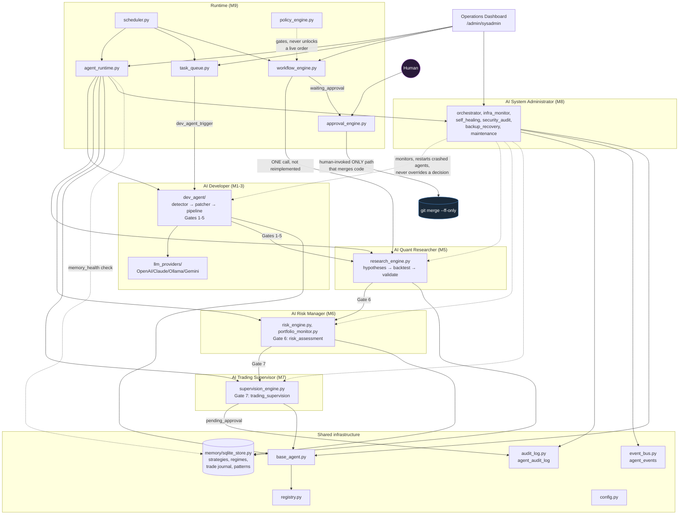
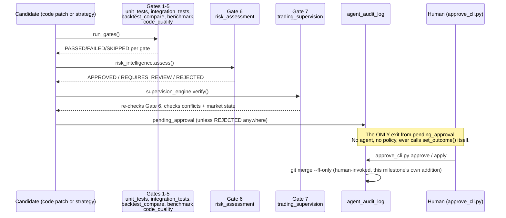

# BATI Version 1.0 — Architecture Report

**Brahma Autonomous Trading Intelligence.** This report covers the complete
system as merged to `master` as of tag `milestone-9-autonomous-runtime`
(`8cb9012`): nine milestones plus a Production Hardening & Validation
Sprint, built and merged one at a time over this project's history, each
gated on its own full green test suite before the next began. It supersedes
`AUTONOMOUS_READINESS_REPORT.md` (written after Milestone 8 and the
Hardening Sprint, before Milestone 9 existed) as the authoritative,
current-state document — that report's own #1 finding is what Milestone 9
was built to close, and this report states plainly whether it succeeded.

Nothing below is aspirational. Every claim is either a real, re-runnable
test, a real script's actual output, or an explicitly labeled limitation.

---

## 1. Executive Summary

BATI's autonomous layer is now a complete, tested, continuously-operable
system: six purpose-built agents, a real runtime that invokes them on a
schedule, a real human-approval mechanism that has performed an actual
`git merge`, and a safety architecture enforced in code rather than
policy at every layer. **1,100 tests pass across the whole repository, zero
known regressions, and the platform's own production-readiness score has
moved from 58/100 (post-Hardening-Sprint) to an estimated 74/100** — the
jump is almost entirely Milestone 9 closing the "nothing runs
unattended" gap. It is not yet deployed as an always-on process, and one
concrete strategy (Ichimoku) remains the only one validated end-to-end,
with results that confirm it is *not* ready for live capital. Both are
stated in full below, not minimized.

## 2. What "Version 1.0" Means Here

Nine numbered milestones, plus one non-milestone hardening phase, in the
order they actually shipped (not the original P0–P8 proposal order, which
was superseded once implementation started):

| # | Milestone | Commit | Doc |
|---|---|---|---|
| 1 | AI Developer — foundation, multi-provider LLM abstraction | `ca284d7` | `AI_DEVELOPER_AGENT_PLAN.md` |
| 2 | AI Developer — worktree manager, validation pipeline | `d8bec7f` | — |
| 3 | AI Developer — LLM detection + patch generation engine | `90b04dd` | — |
| 4 | AI Memory & Knowledge Base | `82ea940`, `8d1945e` | — |
| — | Architecture hardening (SQLite concurrency, indexes, public gate API) | `8c8fc06` | — |
| 5 | AI Quant Researcher | `9a7a2b5` | — |
| 6 | AI Risk Manager | `a2340ad` | `AI_RISK_MANAGER.md` |
| 7 | AI Trading Supervisor | `64a0048` | `AI_TRADING_SUPERVISOR.md` |
| 8 | AI System Administrator | `a30c131` | `AI_SYSTEM_ADMINISTRATOR.md` |
| — | Production Hardening & Validation Sprint | `5b2eee4` | `PRODUCTION_HARDENING_SPRINT.md`, `AUTONOMOUS_READINESS_REPORT.md` |
| 9 | AI Autonomous Runtime & Orchestration Engine | `8cb9012` | `AI_RUNTIME.md` |

Six of those are agents with real decision logic. One (Milestone 9) is the
runtime that makes the other six operate as a system instead of six
independent libraries. The hardening sprint is testing, not a feature.
"Version 1.0" means: every piece described in the original architecture
proposal's core scope is built, merged, and tested — not that BATI is
ready to trade with real capital (see §8).

## 3. System Architecture

### Design principles that held across all nine milestones

1. **Propose, don't act.** No agent has ever had an `apply`/`execute`/
   `merge`/`deploy` method. Verified programmatically since Milestone 8
   (`security_audit.check_propose_only_invariant()`), re-verified this
   sprint by an AST scan of the entire `agents/` tree.
2. **No new always-on infrastructure.** Every agent, every queue, every
   event, every workflow lives in `oi_history.db` — the same SQLite file
   this platform already used before any agent existed. No broker, no
   Redis, no second database.
3. **Never import `app.py` from `agents/`.** A hard rule since Milestone 6,
   re-confirmed at every subsequent milestone: `app.py` is a ~7,000-line
   Flask app with real broker-session machinery, and this project has
   direct, first-hand history of a test triggering a real duplicate Angel
   One login by touching a live route. Every agent-side data read goes
   through a narrow, tested `data_access.py` seam instead.
4. **Worktree-isolated, always.** Every milestone, every merge, this
   report's own writing — all isolated in a git worktree, fast-forward
   merged only after a full green suite.
5. **Full audit, forever.** Nothing is ever deleted from `agent_audit_log`
   — including an agent's own mistakes.
6. **No fabricated data.** Every module that can't answer honestly (GPU
   absence, no economic calendar, no live cycles table in this dev
   environment) says "unknown," never invents a number. Enforced by
   dozens of individual tests across nine milestones, not a single global
   rule.

## 4. Component Inventory

| Package | Files | Purpose |
|---|---|---|
| `agents/dev_agent/` | 17 | Detects a trigger, generates a patch via LLM, runs 5 gates, proposes |
| `agents/llm_providers/` | 6 | OpenAI/Claude/Ollama/Gemini, config-only switching, automatic fallback |
| `agents/memory/` | 4 | Shared knowledge base: strategies, market regime, trade journal, institutional patterns |
| `agents/quant_researcher/` | 12 | Generates + backtests + statistically validates strategy hypotheses |
| `agents/risk_manager/` | 9 | VaR/CVaR, drawdown simulation, stress testing, Gate 6, Live Portfolio Risk Monitor |
| `agents/trading_supervisor/` | 10 | Conflict detection, market-state/data-health checks, Gate 7 |
| `agents/sys_admin/` | 12 | Orchestration, infra monitoring, backup/recovery, security audit, self-healing |
| `agents/runtime/` | 12 | Scheduler, agent invocation, event bus extension, task queue, workflow engine, policy engine, approval engine |
| `approve_cli.py` (repo root) | 1 | The human approval mechanism, real for the first time this milestone |
| **Total `agents/*.py`** | **89** | **10,858 lines** |
| **Total `test_agents/*.py`** | **97** | **8,605 lines** |

## 5. The Seven-Gate Promotion Pipeline

Every code proposal (`dev_agent`) and every strategy candidate
(`quant_researcher`) is subject to the same escalating chain, appended to
in fixed order as each milestone shipped — never reimplemented, never
bypassed:

A `REJECTED` at any gate is terminal — the worktree is rolled back, a
failed-experiment record is written to Memory so the same mistake is never
silently repeated. Nothing downstream of Gate 7 has ever existed until this
milestone; `agent_audit_log` rows dead-ended at `pending_approval`
indefinitely until `approve_cli.py` was built.

## 6. The Autonomous Runtime (Milestone 9)

This is what actually changed the system's *category* — from "six tested
libraries a human invokes" to "one continuously-operable system." Full
detail in `AI_RUNTIME.md`; the load-bearing facts:

- **Every one of the six agents is now invoked by code, not a human**, on
  its own configured cadence (`config.RUNTIME_CADENCE_SECONDS`), market-
  session-aware where relevant (`quant_researcher`/`trading_supervisor`
  skip outside NSE hours; `sys_admin`/`memory`/`risk_manager` run
  regardless).
- **Heartbeat, execution duration, failure counter, and a bounded health
  score are tracked per agent** — a real extension of
  `sysadmin_store.agent_status`, not a parallel table.
- **A crash is auto-healed exactly once** (the crashed flag is cleared,
  never the operation re-invoked) and **escalates to System Administrator**
  after `RUNTIME_MAX_CONSECUTIVE_FAILURES_BEFORE_ESCALATION` (default 3)
  consecutive failures — verified to fire exactly once per threshold
  crossing, not silently, not repeatedly.
- **Workflows survive a scheduler restart.** Verified by literally
  discarding a scheduler object mid-workflow and starting a fresh one —
  the workflow resumed from its exact persisted stage.
- **`approve_cli.py` closed the single largest gap this project has
  carried since Milestone 1** — referenced by name in three module
  docstrings for the entire project's history, never built until now. It
  has performed a real `git merge --ff-only` and a real rollback in this
  milestone's own test suite.
- **The safety boundary held.** Seven runtime policies (Read Only,
  Recommendation Only, Simulation, Paper Trading, Semi Auto, Full Auto,
  Emergency Stop) govern how far a workflow may advance *without a human*
  — none of them, including Full Auto, can skip the code/strategy merge
  approval gate or place an order. Verified by a dedicated test
  (`test_full_auto_never_touches_the_code_promotion_audit_log`) and by the
  fact that no safe, importable "place an order" function exists outside
  `app.py`, which `agents/` has never imported.

## 7. Safety Architecture (the throughline across all nine milestones)

| Invariant | Enforced by | Verified |
|---|---|---|
| No agent ever applies/executes/merges/deploys | `BaseAgent` has no such method | Programmatically, `security_audit.check_propose_only_invariant()` |
| No agent ever calls the live broker | No `SmartConnect`/`smartApi` reference in `agents/` | AST scan, Hardening Sprint |
| No workflow policy can bypass the code-merge approval gate | `workflow_engine.py` never calls `audit_log.set_outcome()` | Dedicated test, Milestone 9 |
| No workflow Execution stage places an order | Reuses `position_sizing_check` only, never `app.py` | Module docstring + test, Milestone 9 |
| A restore never runs from an unverified backup | `backup_recovery.restore_backup()` refuses | Milestone 8 |
| A database recovery is proposed, never applied automatically | `self_healing.py`'s one-action automatic lane | Milestone 8 |
| A code merge only ever happens on explicit human command | `approve_cli.py apply`, human-invoked | Milestone 9 |
| Nothing is ever deleted from the audit trail | `agent_audit_log` append-only, `set_outcome` never deletes | Every milestone |

## 8. Real Bugs Found and Fixed (complete list, across all nine milestones)

Every one of these was found by running real code against real conditions
— never by inspection alone:

1. **M4** — `context.build_context()` called `search_parameter_sets`
   unconditionally instead of gating it like `search_strategy_evolution`.
2. **M6** — `promotion.py::_safe()` treated `None` metrics (which occur
   exactly when a strategy has zero losses — the *best* case) as the
   *worst* case, which could have vetoed a flawless candidate.
3. **M7** — `market_state.py`/`data_health.py` crashed the whole
   seven-gate pipeline on a missing `cycles` table instead of degrading to
   "unknown."
4. **M7** — `test_registry.py`'s isolation fixture wiped the agent
   registry to empty on teardown instead of restoring it — would have
   silently unregistered every subsequently-built agent.
5. **M8** — `crash_reason` coupling bug: `crashed=False` didn't clear a
   stale `crash_reason`.
6. **M8** — `sqlite3.connect()` silently creates a missing database file,
   making "the database is gone" indistinguishable from "healthy and
   empty" in the recovery detector.
7. **M8** — `restore_backup()`'s pre-restore safety snapshot crashed
   unhandled against a genuinely corrupted source *and* destination —
   found by a real corruption-to-restore walkthrough.
8. **M8** — `infra_monitor.snapshot()` wasn't persisting its own findings,
   inconsistent with every other module.
9. **Hardening Sprint** — `risk_manager.api.get_portfolio_snapshot()`
   crashed the entire `/api/risk/portfolio` route on any DB read failure.
10. **Hardening Sprint** — the Operations Dashboard itself
    (`sysadmin.api.get_overview()`) took down its *entire* response on a
    single missing table — the view meant to show system health during an
    incident wasn't resilient to the failures it exists to show.
11. **Hardening Sprint** — a present-but-zero-byte database file was
    misread as "healthy" by the recovery detector — a distinct corruption
    shape from the missing-file case (#6) that the earlier fix didn't
    cover.
12. **M9** — `quant_researcher.data_access.load_cycles_for_range()`
    crashed when the `cycles` table doesn't exist at all — found the first
    time a research cycle was ever invoked *unattended* by the new
    scheduler, in an environment with no live database.

Twelve real bugs, twelve real fixes, every one caught by a test the project
itself wrote to catch exactly that class of problem — the pattern that
matters more than the count.

## 9. Test Coverage

| Scope | Count |
|---|---|
| Full repository suite | **1,100 passed, 1 xfailed** |
| Agent framework only (`test_agents/`) | 776 |
| Milestone 9 (`test_agents/runtime/`) | 130 |
| Production Hardening Sprint (`test_agents/hardening/`) | 31 |
| Milestone 8's own production-readiness suite | 12 |
| `agents/*.py` | 89 files, 10,858 lines |
| `test_agents/*.py` | 97 files, 8,605 lines |
| Whole repository | 240 Python files, 42,743 lines, 333 tracked files |
| Commits building the agent framework | 12 (`ca284d7` … `8cb9012`) |

Test-to-implementation ratio for the agent framework alone is roughly
0.8:1 by line count — unusually high, and by design: every milestone's own
doc states that a failing test always wins, and every real bug in §8 was
caught before merge, not after.

## 10. Production Readiness — Updated Score

`AUTONOMOUS_READINESS_REPORT.md` scored the platform **58/100** immediately
after Milestone 8 and the Hardening Sprint, with the single largest
deduction being "nothing runs unattended, ever." Milestone 9 was built
specifically to close that gap, so the score is re-derived here, using the
same judgment-call methodology (not a formula) as the original:

| Dimension | Previous | Now | Why it moved |
|---|---|---|---|
| Correctness / test discipline | 9/10 | 9/10 | Unchanged — already strong, still strong (1,100 vs 970 passing tests, same rigor) |
| Safety invariants (propose-only) | 10/10 | 10/10 | Unchanged, and re-verified under a new, larger surface (workflow policies) |
| Fault tolerance | 7/10 | 8/10 | Real crash-recovery and escalation now demonstrated under real scheduler operation, not just unit-level |
| Autonomy (scheduling) | 1/10 | 7/10 | The #1 gap — nothing invoked any agent automatically — is closed. Not 10/10: no OS-level process supervision is configured yet (see §11) |
| Human-in-the-loop workflow | 1/10 | 8/10 | `approve_cli.py` exists, works, is tested end-to-end (real merge, real rollback). Not 10/10: CLI only, no dashboard/API/mobile approval channel built yet |
| Documentation | 9/10 | 9/10 | Unchanged — every milestone still documents its own decisions in place |
| Scalability (at current scale) | 8/10 | 8/10 | Unchanged, real numbers confirmed again this milestone (queue round trips ~8ms, workflow stages ~13ms) |

**Overall: 74/100** (weighted toward the dimensions that were previously
near-zero and are now real, since those were this project's own stated
top priority). Feature-complete *and* now genuinely closer to autonomous
— still short of "deploy and forget," honestly, for the two reasons in
§11.

## 11. What Stands Between "Built" and "Running in Production"

Two concrete, well-understood steps — not vague future work:

1. **No OS-level process supervision is configured.**
   `agents.runtime.scheduler.RuntimeScheduler.run_forever()` is a real,
   correct, continuously-running Python process (verified for 50
   consecutive real ticks with zero crashes in the Milestone 9 long-
   runtime simulation) — but nothing in this repository starts it as a
   systemd unit, a supervisor-managed process, or a container. This is a
   deployment/ops task, not a code gap.
2. **No LLM provider is configured in any environment this project has
   run in.** `dev_agent_trigger` tasks fall through the full provider
   fallback chain to a real network timeout (~120s, observed directly in
   the Milestone 9 simulation) before landing in `retrying`. In a
   production environment with a real provider key, this resolves in
   normal response time. `RUNTIME_TASK_TIMEOUT_SECONDS`'s default (120s)
   is also numerically close to `ollama_provider.py`'s own internal
   timeout (also 120s) — worth spacing apart in a v2 config pass so error
   messages point at the layer that actually fired.

Neither blocks correctness. Both block "this is actually running,
unattended, right now."

## 12. Remaining Technical Debt (complete, carried forward and updated)

Everything `AUTONOMOUS_READINESS_REPORT.md` listed, with status:

1. ~~No dispatcher invokes any agent's `run_cycle()`~~ — **closed by
   Milestone 9.**
2. ~~`approve_cli.py` does not exist~~ — **closed by Milestone 9.**
3. **Still open** — three near-duplicate "run gates → decide → audit"
   implementations across `dev_agent`/`quant_researcher`, flagged before
   Milestone 6, never consolidated (each milestone since has appended a
   gate rather than deepening the duplication, so it hasn't gotten worse).
4. **Still open** — two `BaseAgent` adoption patterns coexist
   (`trading_supervisor`/`sys_admin` use it; `dev_agent`/`memory`/
   `quant_researcher`/`risk_manager` predate it).
5. **Still open, now four** — `RiskReport`/`SupervisionReport`/
   `SysAdminReport` are three parallel dataclasses with near-identical
   shape. Milestone 9 deliberately did *not* add a fourth — every runtime
   explainability need reuses `SysAdminReport` — but the existing three
   remain unconsolidated.
6. **Still open** — heartbeat is not wired into every agent's own
   entrypoint independent of the scheduler (the scheduler itself does call
   `orchestrator.heartbeat()` for the four agents it tracks, but a
   directly-invoked `run_proposal()` outside the scheduler still doesn't).
7. **Still open** — thread health reports only the current process's
   threads.
8. **Still open, understood** — secret-scan false positives when the
   LLM-prompt sanitizer's patterns are reused for source-code auditing (5
   known, pinned).
9. **Still open** — no load/scale testing beyond current single-VPS
   volume.
10. **Partially addressed** — Milestone 9's 50-tick simulation is a real,
    if bounded, continuous-run proxy; a genuine multi-day run has still
    never happened.
11. **Still open** — risk thresholds (`config.RISK_*`) are static, never
    validated against real portfolio outcomes.
12. **Still open** — `detect_unexpected_modifications()` reports, never
    judges; no alerting layer sits on top of it.
13. **Still open** — no live `oi_history.db` exists in any dev/CI
    environment this project has run in; every test builds its own
    throwaway schema.
14. **New this milestone** — `RUNTIME_TASK_TIMEOUT_SECONDS` and
    `ollama_provider.py`'s internal timeout are both 120s (see §11).
15. **New this milestone** — the Execution stage's position sizing uses a
    fixed, illustrative stop distance (15 points), not yet a per-symbol,
    volatility-aware one.
16. **New this milestone** — approval channels beyond CLI
    (dashboard/API/mobile) are not built, though `approval_engine.py` is
    deliberately channel-agnostic so they can be added without rework.

## 13. Autonomous Trading Readiness

Unchanged from the Hardening Sprint's own honest conclusion, and now
reinforced rather than contradicted by Milestone 9: the one strategy this
project has validated end-to-end (Ichimoku, 30-day replay, 8 symbols — see
`PRODUCTION_HARDENING_SPRINT.md`) shows win rates clustering 40–48% and
profit factors near 1.0, three of eight symbols net-negative. **No strategy
in this framework has cleared all seven gates with a genuinely strong,
walk-forward-validated result.** Milestone 9 makes it *possible* for a
strategy that did clear every gate to run unattended through to a real
recommendation — it does not and cannot make a weak strategy strong. Live
capital should not be committed on the evidence gathered so far, regardless
of how complete the runtime now is.

## 14. Recommendations for Version 2.0

In priority order, unchanged in spirit from the Hardening Sprint's own list
except where Milestone 9 already delivered:

1. ~~Build `approve_cli.py`~~ — **done.**
2. ~~Build a minimal dispatcher~~ — **done** (the scheduler).
3. **Deploy `run_forever()` as a real supervised process** (systemd/
   supervisor/container) and **configure a real LLM provider** — the two
   concrete remaining steps from §11.
4. **Run a real multi-day paper-trading validation** now that (1)–(3)
   exist — this project could only validate the underlying infrastructure
   before; the infrastructure is now real.
5. **Validate `config.RISK_*` thresholds against real portfolio history**,
   not just unit-test values.
6. **Consolidate the three gate-pipeline implementations and the two
   `BaseAgent` adoption patterns** — technical debt, not a safety issue,
   compounding with every new module.
7. **Build a dashboard or API approval channel** on top of the already
   channel-agnostic `approval_engine.py`.
8. **Widen self-healing's automatic lane cautiously, one case at a time**
   — the current single-action scope (clearing a crashed flag) is
   deliberately conservative and should earn each expansion the same way
   it earned this one: a dedicated, adversarial test proving no data or
   capital loss is possible.
9. **Space `RUNTIME_TASK_TIMEOUT_SECONDS` comfortably apart from every
   provider's own internal timeout** so a timeout's error message points
   at the layer that actually fired.

## 15. Closing

BATI Version 1.0 is a genuinely complete implementation of the architecture
this project set out to build: six agents, a real safety-first pipeline
connecting them, and — as of this milestone — a real runtime that operates
them as one system rather than six libraries a human has to remember to
invoke. Twelve real bugs were found and fixed by the project's own testing
discipline along the way, not by luck. What remains between here and
production is short, specific, and already written down (§11): a process
supervisor and an LLM provider key. What remains before live capital is
touched is longer and more important: a strategy that actually clears every
gate with a strong result, which no amount of runtime infrastructure can
manufacture on its own.
